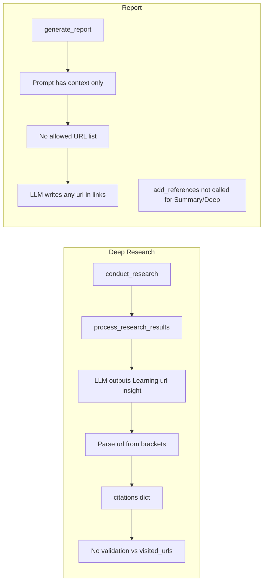

# Fix citation 404 / hallucination limitation

## Intent vs. outcome

The Dex-researcher MVP explicitly calls out **"reliable citations"** as a goal ([docs/DEX-RESEARCHER-MVP.md](docs/DEX-RESEARCHER-MVP.md) line 3). The current behavior—citation URLs that 404 because they are LLM-generated or unvalidated—is an **unintended outcome**, not by design. This plan addresses it as a bug fix and capability improvement.

---

## Root causes (recap)

- **Deep:** Citations come from LLM output in `process_research_results`; the parsed URL is never validated against `visited_urls`, so typos, wrong domains, or invented URLs enter the citation pool and propagate with depth.
- **All types:** The report LLM is never given the list of valid URLs and is asked to "add a reference list"; for Summary and Deep, `add_references(report, visited_urls)` is never called, so the References section (and in-text links) can contain unverified URLs.

---

## Implementation plan

### 1. Ground Deep Research citations in visited URLs

**File:** [gpt_researcher/skills/deep_research.py](gpt_researcher/skills/deep_research.py)

- **Add a citation-sanitization step** so only URLs that appear in the set of actually visited URLs (for that branch) are kept; discard or replace any other URL the LLM produced.
  - In `process_query`, after `results = await self.process_research_results(...)`, you have `visited = researcher.visited_urls` and `results['citations']`. Add a helper (e.g. `_sanitize_citations(citations: Dict[str, str], allowed_urls: Set[str]) -> Dict[str, str]`) that:
    - For each `(learning, url)` in `citations`: if `url` is in `allowed_urls`, keep it; otherwise optionally try to match `url` to one entry in `allowed_urls` (e.g. same path or domain, or normalize and compare); if a unique match is found use it, else drop the citation for that learning (keep the learning without a link rather than a bad link).
  - Call this helper before returning from `process_query` so `results['citations']` passed to `all_citations.update(...)` contains only validated URLs.
- **Optional but recommended:** When building the prompt for `process_research_results`, pass a short list of “valid source URLs for this batch” (e.g. `href`s from the context dicts or `visited`) in the system or user message so the LLM is encouraged to cite from that list. The sanitization step remains the source of truth.

**Outcome:** Deep Research no longer injects hallucinated or wrong URLs into the citation pool; depth no longer multiplies bad links.

---

### 2. Pass allowed URLs into the report prompt and constrain the LLM

**Files:** [gpt_researcher/prompts.py](gpt_researcher/prompts.py), [gpt_researcher/actions/report_generation.py](gpt_researcher/actions/report_generation.py), [gpt_researcher/skills/writer.py](gpt_researcher/skills/writer.py)

- **Prompts:** Extend the report prompt builders used for web reports (e.g. `generate_report_prompt`, `generate_deep_research_prompt`) with an optional parameter such as `allowed_urls: List[str] | None = None`. When `allowed_urls` is non-empty:
  - Add a clear instruction: use **only** these URLs for in-text citations and for any reference list (e.g. “The only URLs you may use for citations and references are the following; use them exactly: …”).
  - Optionally add: “Do not invent or alter URLs.”
- **Report generation:** Thread `allowed_urls` through:
  - `generate_report(...)` in [gpt_researcher/actions/report_generation.py](gpt_researcher/actions/report_generation.py) should accept an optional `allowed_urls` (e.g. from the researcher’s `visited_urls` or `get_source_urls()`).
  - Pass `allowed_urls` into `generate_prompt(...)` so the prompt family can inject the list.
- **Writer:** In [gpt_researcher/skills/writer.py](gpt_researcher/skills/writer.py), when calling the code path that leads to `generate_report`, pass `allowed_urls=self.researcher.get_source_urls()` (or `list(self.researcher.visited_urls)`) for web reports so the report LLM has a single source of truth for links.

**Outcome:** In-text citation links and any LLM-generated reference list are constrained to actually-visited URLs, reducing 404s from the report writer.

---

### 3. Append a programmatic References section for Summary and Deep

**Files:** [gpt_researcher/agent.py](gpt_researcher/agent.py), [gpt_researcher/actions/markdown_processing.py](gpt_researcher/actions/markdown_processing.py) (optional small tweaks)

- **Behavior:** For report types that currently do **not** call `add_references` (i.e. Summary/Basic and Deep), after the report markdown is returned from `write_report`, append a programmatic “## References” section built from `visited_urls` so the displayed citation section is guaranteed to list only real URLs.
- **Implementation:**
  - In [gpt_researcher/agent.py](gpt_researcher/agent.py), inside `write_report`, after `report = await self.report_generator.write_report(...)`:
    - If `report_source == ReportSource.Web.value` and `self.visited_urls`, call `report = self.add_references(report, self.visited_urls)`.
  - This will append “## References” and one “- [url](url)” per visited URL. To avoid duplicate “References” headings when the LLM also outputs one, either:
    - **Option A (simplest):** In the same prompt changes as in step 2, instruct the LLM: “Do not add a reference list at the end; it will be added automatically.” Then the only References block is the programmatic one.
    - **Option B:** Before calling `add_references`, strip an existing “## References” (and content until next `##` or end) from the report, then append; more robust but more parsing.
- **Detailed report:** Leave [backend/report_type/detailed_report/detailed_report.py](backend/report_type/detailed_report/detailed_report.py) as-is for the conclusion (it already calls `add_references`); no need to double-append for that path.

**Outcome:** The References section for Summary and Deep is built from `visited_urls` only, so it does not contain 404s.

---

### 4. Tests and docs

- **Tests:** Add or extend tests that:
  - For Deep Research: assert that after a run, every URL in the citations dict (or in the final context’s `[Source: url]` strings) appears in `visited_urls` (or in the allowed set used for sanitization).
  - For report generation: when `allowed_urls` is passed, assert the prompt contains that list (or a substring); optionally run a short report generation and assert no link in the report body or references is outside `allowed_urls`.
  - For Summary/Deep: assert that after `write_report`, the report contains a “## References” block and that every listed URL is in `visited_urls`.
- **Docs:** In [docs/DEX-RESEARCHER-MVP.md](docs/DEX-RESEARCHER-MVP.md) (or a short “Reliable citations” subsection), note that citations and the References section are grounded in visited URLs and that Deep Research validates extracted citations against them.

---

## Order of work

1. Implement citation sanitization in Deep Research (step 1).
2. Add `allowed_urls` to prompts and report generation path (step 2).
3. Append programmatic References in `write_report` for Summary and Deep (step 3).
4. Add tests and doc updates (step 4).

---

## Phases for sequential agent chats

Use **one phase per agent chat** to keep context short and avoid blowout. Hand off by committing after each phase; start the next chat with “Execute Phase N of the citation 404 fix plan.”

| Phase       | Scope                                    | Main files                                                                                                                                                                                                             | Done when                                                                                                                                         |
| ----------- | ---------------------------------------- | ---------------------------------------------------------------------------------------------------------------------------------------------------------------------------------------------------------------------- | ------------------------------------------------------------------------------------------------------------------------------------------------- |
| **Phase 1** | Deep Research citation sanitization only | [gpt_researcher/skills/deep_research.py](gpt_researcher/skills/deep_research.py)                                                                                                                                       | `_sanitize_citations` and `_normalize_url_for_match` exist; `process_query` calls sanitization before returning citations.                        |
| **Phase 2** | Allowed URLs in prompts and report path  | [gpt_researcher/prompts.py](gpt_researcher/prompts.py), [gpt_researcher/actions/report_generation.py](gpt_researcher/actions/report_generation.py), [gpt_researcher/skills/writer.py](gpt_researcher/skills/writer.py) | `generate_report_prompt` and `generate_deep_research_prompt` accept `allowed_urls`; `generate_report` and writer pass it through for web reports. |
| **Phase 3** | Programmatic References for Summary/Deep | [gpt_researcher/agent.py](gpt_researcher/agent.py)                                                                                                                                                                     | In `write_report`, after report is generated, if web and `visited_urls`: `report = self.add_references(report, self.visited_urls)`.               |
| **Phase 4** | Tests and docs                           | [tests/test_citation_sanitization.py](tests/test_citation_sanitization.py), [docs/DEX-RESEARCHER-MVP.md](docs/DEX-RESEARCHER-MVP.md)                                                                                   | Tests for `_sanitize_citations` / `_normalize_url_for_match`; “Reliable citations (web)” section in MVP doc.                                      |

**Dependencies:** Phase 2 can run after Phase 1. Phase 3 assumes Phase 2 (prompt says “do not add reference list”; Phase 3 appends it). Phase 4 can be done after 1–3 or in parallel with 2–3 once Phase 1 exists.

---

## Risks and mitigations

- **Over-strict sanitization:** If we drop every non-matching URL, some valid citations might be lost when the LLM slightly alters the URL (e.g. trailing slash). Mitigation: in `_sanitize_citations`, allow simple normalizations (e.g. strip fragment, normalize path) and fuzzy match to one allowed URL before dropping.
- **Prompt length:** A large `visited_urls` set could bloat the prompt. Mitigation: cap the number of URLs included in the prompt (e.g. first 50–100) or summarize by domain; the programmatic References section can still list all.

---

## Summary

| Area                 | Change                                                                                                          |
| -------------------- | --------------------------------------------------------------------------------------------------------------- |
| Deep Research        | Sanitize `process_research_results` citations against `visited_urls` (and optionally prompt with allowed URLs). |
| Report prompts       | Optional `allowed_urls`; instruct LLM to use only those URLs and (if desired) not add a reference list.         |
| Report generation    | Pass researcher’s visited/source URLs into `generate_report` and prompt.                                        |
| Agent `write_report` | For web Summary/Deep, append `add_references(report, visited_urls)` after report is generated.                  |
| Tests & docs         | Tests for citation validity and programmatic References; doc note on reliable citations.                        |

This keeps the existing architecture (same entry points, same report types) while making citations and the citation section reliable and aligned with the MVP goal.