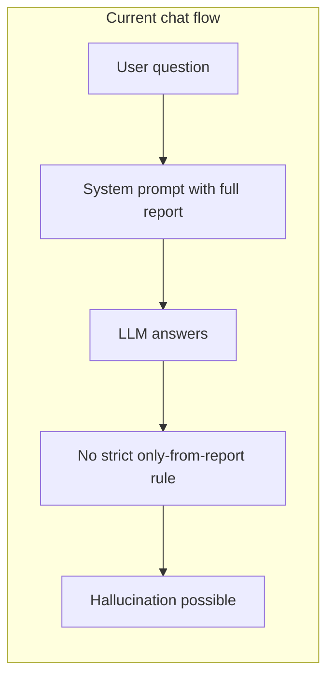

# Ground report Q&A to reduce hallucinations

## Problem

When users ask questions about the report in chat, the LLM is **not strictly grounded**. In [backend/chat/chat.py](backend/chat/chat.py) the system prompt only says "Answer based on the given context and report" and "You must include citations... based on the report." That does not forbid inventing content, and the model can:

- Fill in details not in the report
- Invent numbers, quotes, or "citations" that sound plausible
- Mix report content with general knowledge without saying so

The prompt also encourages using **quick_search** for "current data not found in the report," which blurs the line between report-only answers and web answers and can encourage mixing or confabulation.

---

## Root cause (chat path)

- **No strict "only from report" rule** – model is free to use prior knowledge or invent.
- **Full report in system prompt** – for long reports, context limits can truncate it or the model may not faithfully use the whole thing.
- **Vector store disabled** – RAG over the report exists in code but is turned off (`if not self.vector_store and False` at line 78), so retrieval is never used.

---

## Recommended fix (easy): Harden the chat system prompt

**File:** [backend/chat/chat.py](backend/chat/chat.py) (system prompt in `chat()`, ~lines 200–218)

**Changes:**

1. **Add explicit grounding rules** in the system prompt:
  - Answer **only** from the content of the report below. Do not use general knowledge or invent facts, numbers, or quotes.
  - If the report does not contain information that answers the question, say clearly: e.g. "That isn't covered in the report" or "The report doesn't discuss that."
  - When you cite or refer to the report, only refer to content that actually appears in the report (do not invent section names, quotes, or URLs).
2. **Clarify when to use quick_search:**
  - Use the quick_search tool **only** when the user explicitly asks for information that is clearly outside the report (e.g. "latest news," "updated statistics," "what happened after the report"). When using search, state that you are supplementing with external sources.
  - For normal questions about the report, do **not** call quick_search; answer only from the report.
3. **Keep** the existing report injection (`Report: {self.report}`) and citation requirement; the above rules sit alongside them.

**Outcome:** The model gets a clear contract: report-only answers unless the user clearly asks for external/current info; say "not in the report" when appropriate; no invented content. This is a small, low-risk change that should noticeably reduce hallucinations for report Q&A.

---

## Optional enhancement: Re-enable RAG over the report

**File:** [backend/chat/chat.py](backend/chat/chat.py)

- The class already has `_setup_vector_store()`, `_process_document()`, and `self.retriever`; the only guard is `if not self.vector_store and False` (line 78), which disables setup.
- **Option A:** Re-enable by changing to `if not self.vector_store` so the report is chunked and stored. Then in `chat()`, instead of (or in addition to) putting the full report in the system prompt, **retrieve** the top-k chunks for the **current user question** and put those in the system prompt as "Relevant report excerpts: ..." so the model sees focused, relevant passages. For long reports this reduces truncation and focuses the model on what’s actually relevant.
- **Option B:** Keep passing the full report as today but add a retrieval step and prepend "Most relevant passages for this question:" so the model sees both full report and highlighted excerpts. Simpler but uses more tokens.

Recommendation: implement **prompt hardening first** (no dependency on embeddings or config). Add RAG re-enable as a second step if you need better behavior on very long reports or want stronger grounding via retrieval.

---

## Out of scope (for clarity)

- **Citation 404 fix** – Your existing plan ([.cursor/plans/fix_citation_404_hallucinations_4ed1ddde.plan.md](.cursor/plans/fix_citation_404_hallucinations_4ed1ddde.plan.md)) addresses report **generation** (Deep Research, report writer, References section). The change above addresses **chat about the report** (user asks a question; LLM answers). They are complementary.
- **Post-hoc fact-checking** – No change to response parsing or external verification in this plan; grounding is achieved by prompt (and optionally RAG) only.

---

## Summary

| Change                                                                                                                    | Where                                        | Effort |
| ------------------------------------------------------------------------------------------------------------------------- | -------------------------------------------- | ------ |
| Harden system prompt: "only from report," "say if not in report," "no invented content," clarify when to use quick_search | [backend/chat/chat.py](backend/chat/chat.py) | Small  |
| Optional: Re-enable vector store and use retrieved chunks for context in `chat()`                                         | [backend/chat/chat.py](backend/chat/chat.py) | Medium |

Implementing the prompt hardening alone is enough to correct most report Q&A hallucinations with minimal code change and no new dependencies.