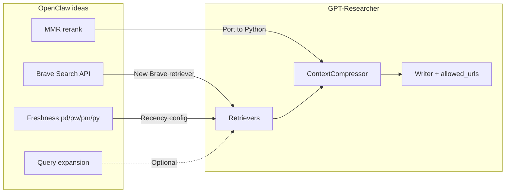

# OpenClaw → GPT-Researcher: Improvement Opportunities for Research & Report Quality

## Context

- **OpenClaw** ([openclaw](openclaw/)): Personal AI assistant and multi-channel gateway (messaging, tools, agents). It does **not** implement research pipelines, report generation, or fact-checking. Relevant parts: web search tool (Brave, Perplexity, Grok), memory layer (hybrid FTS + vector, MMR reranking, query expansion). For GPT-Researcher we only adopt **Brave** (Perplexity excluded: no ZDR, no free plan, training concerns).
- **GPT-Researcher** ([gpt_researcher](gpt_researcher/)): Research agent that plans queries, searches (Tavily, Serper, Bing, MCP, etc.), scrapes and compresses context, then writes reports with allowed-URL citation constraints and optional citation improver and source curation.

Below are concrete improvements gpt-researcher could adopt, **focused on finding information and producing high-quality, grounded reports**.

---

## 1. MMR re-ranking for context selection (high value)

**OpenClaw:** [openclaw/src/memory/mmr.ts](openclaw/openclaw/src/memory/mmr.ts) implements Maximal Marginal Relevance (MMR): `λ * relevance - (1-λ) * max_similarity_to_selected` with Jaccard over tokenized content to balance relevance and diversity. Used in [hybrid.ts](openclaw/openclaw/src/memory/hybrid.ts) after hybrid search.

**GPT-Researcher today:** [gpt_researcher/context/compression.py](gpt_researcher/context/compression.py) uses `ContextCompressor` with `EmbeddingsFilter` and a similarity threshold only—no diversity reranking. Redundant or near-duplicate chunks can dominate context and hurt report coverage.

**Recommendation:** Port MMR to Python (e.g. `gpt_researcher/context/mmr.py`): same formula, relevance scores from existing retrieval, text similarity via Jaccard or existing embeddings. Add an optional MMR step in the context pipeline (e.g. after `ContextCompressor` or inside it) with config (e.g. `ENABLE_MMR_RERANK`, `MMR_LAMBDA` default 0.7). This improves diversity of evidence and can yield more balanced, better grounded reports.

---

## 2. Brave Search backend (high value)

**OpenClaw:** [openclaw/src/agents/tools/web-search.ts](openclaw/openclaw/src/agents/tools/web-search.ts) uses **Brave Search API**: raw results (title, url, description), optional freshness (pd/pw/pm/py or date range `YYYY-MM-DDtoYYYY-MM-DD`), country/search_lang, and request caching.

**GPT-Researcher today:** Retrievers in [gpt_researcher/retrievers/](gpt_researcher/retrievers/) include Tavily, Serper, Bing, Exa, MCP, etc. No Brave. Tavily has `days` for recency; other APIs are not consistently used for recency.

**Recommendation:** Add a **Brave retriever** that calls the Brave Search API (`https://api.search.brave.com/res/v1/web/search`), returns a list of results in the existing pipeline format (url, title, snippet/body). Support optional freshness (pd/pw/pm/py or date range) so recency can be passed through (see section 3). Implementation: new module under [gpt_researcher/retrievers/](gpt_researcher/retrievers/) (e.g. `brave/`), same contract as other retrievers (`.search()` returning list of dicts); register in [gpt_researcher/retrievers/utils.py](gpt_researcher/retrievers/utils.py); document `BRAVE_API_KEY` (or `BRAVE_SEARCH_API_KEY`).

**Note:** Perplexity is explicitly **not** recommended (no zero-data-retention option, no free plan, and search data may be used for model training). Grok is left as an optional future addition if desired; Brave alone gives a strong additional source with good freshness control.

---

## 3. Freshness / recency control (medium value)

**OpenClaw:** Web search supports `freshness`: shortcuts (pd/pw/pm/py) and date range `YYYY-MM-DDtoYYYY-MM-DD` for Brave.

**GPT-Researcher today:** Tavily has `days`; other retrievers do not expose a common recency parameter.

**Recommendation:** Introduce a shared notion of “recency” in config (e.g. `RECENCY`: last day / week / month / year or date range). In `get_search_results` (or per-retriever), pass this through where the API supports it (Tavily `days`, new Brave retriever). Use it in query planning when “recent” information is important (e.g. news, market data). Keeps report quality higher for time-sensitive topics.

---

## 4. Optional query expansion for retrieval (lower priority)

**OpenClaw:** [openclaw/src/memory/query-expansion.ts](openclaw/openclaw/src/memory/query-expansion.ts) does keyword extraction (stop-word removal, tokenization) and optional LLM-based expansion for FTS. Used to improve recall for conversational queries.

**GPT-Researcher today:** Sub-queries are generated by LLM in [gpt_researcher/actions/query_processing.py](gpt_researcher/actions/query_processing.py) (`generate_sub_queries`, `plan_research_outline`). So “query expansion” for planning is already LLM-driven. No keyword-based expansion at retrieval time.

**Recommendation:** Lower priority. If desired, add an optional step before calling a retriever for a **single** query: expand with keywords (e.g. port OpenClaw’s `extractKeywords` to Python) or with a lightweight LLM call, then run retrieval for original + expanded queries and merge/dedupe. Could improve recall for short or vague queries; implement only if MMR and new retrievers are in place and there is still a recall gap.

---

## 5. Search result caching (minor)

**OpenClaw:** In-memory cache for web search by (provider, query, params) with TTL ([web-search.ts](openclaw/openclaw/src/agents/tools/web-search.ts) `SEARCH_CACHE`, `readCache`, `writeCache`).

**GPT-Researcher today:** MCP results are cached in [gpt_researcher/skills/researcher.py](gpt_researcher/skills/researcher.py) for the run; Tavily can use API-level cache. No general cross-query cache for retriever responses.

**Recommendation:** Optional in-memory (or small file) cache for retriever output keyed by (retriever name, query, recency). Reduces duplicate API calls across sub-queries or runs and cost; keep TTL short (e.g. minutes) so reports stay fresh.

---

## What OpenClaw does not provide (unchanged gaps in GPT-Researcher)

OpenClaw has **no**:

- Fact-checking or claim–source verification
- Report-quality or citation-accuracy evaluation
- Dedicated “research report” pipeline

So the following gpt-researcher gaps are **not** addressed by openclaw and would require other work if desired:

- **Claim–source verification:** Check that each cited claim is supported by the cited URL/content (e.g. NLI or retrieval over source text).
- **Structured citation injection:** Retrieval per section/sentence with (url, snippet) pairs and forcing the model to use them.
- **Evaluation pipeline:** Metrics for citation accuracy, factual consistency, or retrieval relevance.

---

## Suggested implementation order

1. **Brave retriever**: New Brave Search API retriever with optional freshness (pd/pw/pm/py or date range); register and document `BRAVE_API_KEY`.
2. **MMR re-ranking** in the context pipeline (Python port, config flags, integration in [gpt_researcher/context/compression.py](gpt_researcher/context/compression.py) or [gpt_researcher/skills/context_manager.py](gpt_researcher/skills/context_manager.py)).
3. **Recency/freshness** config and pass-through to Tavily and the Brave retriever.
4. Optional: query expansion at retrieval; optional search result cache.

---

## Summary diagram

This keeps the scope aligned with the primary use case: **finding information** (Brave as additional retriever, diversity via MMR, recency) and **producing high-quality, grounded reports** (same allowed_urls + citation improver flow, no Perplexity).